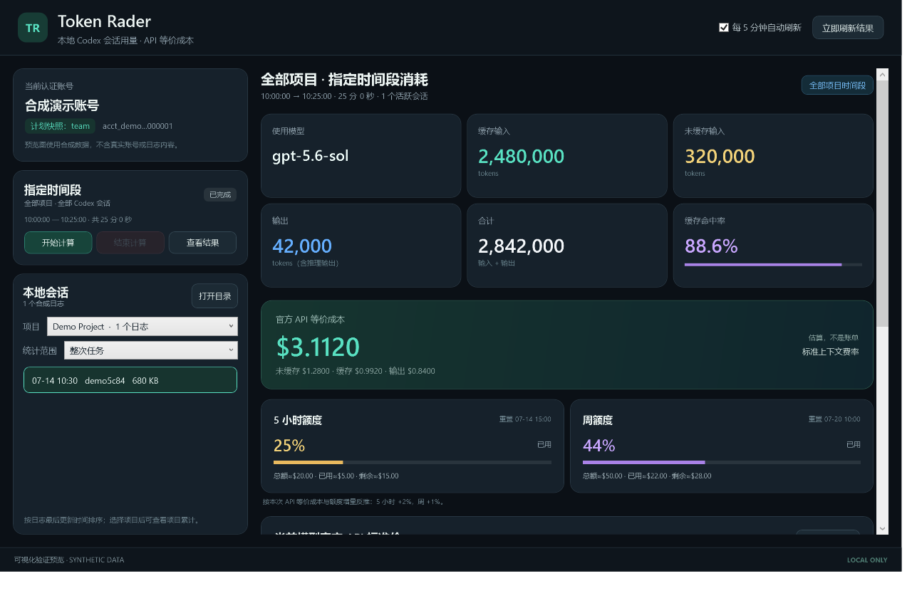

# Token Rader

[](https://github.com/lmy1390734971-netizen/Codex-Limit-USD-Radar/actions/workflows/test.yml)

Token Rader 是一个只在本机运行的 Windows 桌面程序。它读取 Codex 已写入本机的 JSONL 会话日志，统计任务、模型调用、指定时间段或指定项目的 token 用量，并按 OpenAI 官方 API 标准处理价格计算美元等价成本。



## 项目解决的问题

Codex 日志包含输入、缓存输入、输出、模型和额度百分比等信息，但原始 JSONL 不方便直接查看，也不能直接回答以下问题：

- 某次 Codex 工作消耗了多少 token？
- 缓存输入和未缓存输入分别是多少？
- 同一时间段内多个对话、多个模型一共消耗多少？
- 某个项目累计使用了多少 token 和 API 等价美元？
- 5 小时和周额度使用了多少，能否根据百分比变化反推美元等价额度？

Token Rader 在本机解析这些日志，不要求 API Key，也不会上传提示词、回复正文或工具输出。

## 主要功能

- 显示使用模型、缓存输入、未缓存输入、输出、合计和缓存命中率。
- 提供“整次任务”“最后一次调用”和“所选项目累计”三种统计范围。
- 支持“开始计算—结束计算”，统计指定时间段内全部项目和全部 Codex 会话的增量。
- 同一会话切换模型时按每次调用对应的模型分别计价。
- 识别任务树中的父任务、子任务和重复累计记录，减少继承历史造成的重复计费。
- 按每次调用判断 272K 长上下文价格倍率。
- 显示 5 小时和周额度百分比、重置时间及可校准的美元等价额度。
- 每 5 分钟自动刷新，并保留“立即刷新”和“查看结果”。
- 时间段统计在后台线程计算，日志解析不会卡住界面；日志无新增时重复“查看结果”直接使用缓存结果。
- 内置 C# + SQLite 索引引擎，首次启动把日志记录导入临时 SQLite 索引，会话/项目查看毫秒级响应。
- 所有计算在本机完成，不修改 Codex 日志。

## 软件和硬件环境

### 软件环境

| 项目 | 要求 |
|---|---|
| 操作系统 | Windows 10/11；GitHub Actions 使用 `windows-latest` |
| PowerShell | Windows PowerShell 5.1，或 Windows 版 PowerShell 7 |
| 图形框架 | WPF（`PresentationFramework`、`PresentationCore`、`WindowsBase`） |
| 构建启动器 | Windows 自带的 .NET Framework C# 编译器；只有重新构建 EXE 时需要 |
| Git | 仅克隆仓库时需要 |
| Python/Node.js | 不需要 |
| OpenAI API Key | 不需要 |

启动器优先使用 PATH 中的 `powershell.exe`，不可用时尝试 `pwsh.exe`。Codex 数据目录优先读取环境变量 `CODEX_HOME`，否则使用当前用户的 `~/.codex`。

### 硬件环境

- 不需要 GPU、CUDA 或专用加速卡。
- 普通 Windows x64 电脑即可运行；其他 Windows 架构尚未验证。
- CPU、内存和读取时间取决于 JSONL 日志数量与大小。
- 程序只读扫描日志；不会重写日志，也不会为日志创建副本。

## 安装方法

### 从 GitHub 克隆

以下命令可直接复制到 PowerShell：

```powershell
git clone https://github.com/lmy1390734971-netizen/Codex-Limit-USD-Radar.git
Set-Location .\Codex-Limit-USD-Radar
powershell.exe -NoProfile -ExecutionPolicy Bypass -STA -File .\tests\Run-Tests.ps1
powershell.exe -NoProfile -ExecutionPolicy Bypass -STA -File .\TokenRader.ps1
```

本项目没有 `requirements.txt`，不需要执行 `pip install`。

### 直接运行

也可以下载完整项目目录，然后使用任一方式启动：

1. 双击 `TokenRader.exe`；
2. 双击 `Start-TokenRader.cmd`；
3. 在项目目录运行：

```powershell
powershell.exe -NoProfile -ExecutionPolicy Bypass -STA -File .\TokenRader.ps1
```

仓库中的启动器没有商业代码签名。若 Windows 显示 SmartScreen 提示，可以运行 PowerShell 脚本，或审查启动器源码后自行构建：

```powershell
powershell.exe -NoProfile -ExecutionPolicy Bypass -File .\Build.ps1
```

## 最小运行示例

1. 确保 Codex 至少完成过一次模型调用，使 `~/.codex/sessions` 中存在含 `token_count` 的 JSONL 日志。
2. 启动 Token Rader。
3. 在左侧选择一个会话。
4. 选择“最后一次调用”即可查看模型、token 和 API 等价美元。
5. 若要测量一段新工作，先点击“开始计算”，完成 Codex 工作后点击“结束计算”。

启动命令与完整克隆示例见上方“安装方法”，不需要额外依赖安装步骤。

## 输入与输出

### 输入

默认输入目录：

```text
%CODEX_HOME%\sessions               # 设置了 CODEX_HOME 时
%USERPROFILE%\.codex\sessions       # 默认位置
```

程序主要读取以下 JSONL 记录：

| 记录/字段 | 用途 |
|---|---|
| `session_meta.payload.cwd` | 识别项目目录 |
| `session_meta.payload.parent_thread_id`、`forked_from_id` | 构建任务树并处理继承历史 |
| `turn_context.payload.model` | 识别每次调用使用的模型 |
| `token_count.info.total_token_usage` | 显示会话累计 token |
| `token_count.info.last_token_usage` | 逐调用、逐模型计价 |
| `cached_input_tokens` | 计算缓存输入和缓存命中率 |
| `rate_limits` | 显示 5 小时与周额度快照 |

可选账号标签来自 `~/.codex/.cockpit_codex_auth.json`。程序不会读取包含访问令牌的 `~/.codex/auth.json`。

### 输出

输出只显示在桌面界面中，不会默认写入结果文件：

- 模型或模型数量；
- 缓存输入、未缓存输入、输出、合计；
- 缓存命中率；
- 未缓存输入、缓存输入、输出和总美元等价成本；
- 统计时间、唯一调用数、去重数量；
- 5 小时与周额度百分比、重置时间和校准后的美元等价值；
- 当前内置官方 API 价格表。

## 算法流程

```text
发现 JSONL 日志
    ↓
读取 session_meta，建立会话、项目和父子任务关系
    ↓
按顺序读取 turn_context 与 token_count
    ↓
将 last_token_usage 绑定到当时使用的模型
    ↓
剔除开始测量前的基线记录和任务树中的共享重复记录
    ↓
计算缓存/未缓存输入、输出、总 token 和缓存命中率
    ↓
按模型价格和长上下文倍率逐调用计价
    ↓
汇总会话、时间段或项目结果并更新额度卡片
```

核心 token 关系：

```text
缓存输入 = cached_input_tokens
未缓存输入 = input_tokens - cached_input_tokens
输出 = output_tokens
合计 = input_tokens + output_tokens
缓存命中率 = cached_input_tokens / input_tokens
```

`output_tokens` 已包含推理输出明细，因此不会再次加上 `reasoning_output_tokens`。

成本公式：

```text
成本 = 未缓存输入 / unitTokens × 输入价
     + 缓存输入 / unitTokens × 缓存输入价
     + 输出 / unitTokens × 输出价
```

`unitTokens` 默认是 1,000,000。超过模型价格表中 `longContextThreshold` 的单次调用会应用相应输入和输出倍率。

## 数据集与数据预处理

### 数据集如何获得

本项目不提供、下载或上传真实用户日志。数据有两种来源：

1. **真实只读数据**：Codex 在正常使用过程中自动生成的本机 `sessions/*.jsonl`；
2. **合成测试数据**：`tests/Run-Tests.ps1` 在系统临时目录动态生成，测试完成后删除，不含真实账号、提示词或回复。

运行普通回归测试不需要真实 Codex 数据。只有 `-Live` 测试要求本机已经存在 Codex 会话日志。

### 数据预处理方法

- 只解析 `session_meta`、`turn_context` 和 `token_count`，忽略提示词与回复正文。
- 将缓存输入限制在 `[0, input_tokens]` 范围内，避免异常日志产生负数。
- 将项目路径正规化并按不区分大小写的完整路径分组。
- 时间段测量记录各日志开始时的字节偏移，只解析新增部分。
- 通过任务根 ID 与完整 token 指纹识别父子日志共享记录。
- 新建分支会对照开始测量时的祖先累计量，剔除测量前继承历史。
- 未知模型价格标记为“无法估算”，不会按 `$0` 处理。

## 科研与实验复现信息

本项目是确定性桌面日志分析软件，不是机器学习训练项目。为便于科研归档，相关字段说明如下：

| 项目 | 配置 |
|---|---|
| 论文名称 | 无对应论文 |
| 算法类型 | 确定性 JSONL 解析、任务树去重、逐调用价格汇总 |
| 训练过程 | 不适用 |
| 训练/验证/测试划分 | 不适用；没有训练数据集 |
| 随机种子 | 不适用；算法和测试不使用随机采样 |
| 数据预处理 | 字段筛选、路径正规化、区间基线、任务树指纹去重 |
| 主要参数 | `unitTokens=1,000,000`、自动刷新 5 分钟、日志行上限 4 MB、长上下文阈值由 `pricing.json` 指定 |
| 评价指标 | token 字段解析正确性、价格公式误差、去重事件数、模型归属、额度反推结果、XAML 控件完整性 |
| 数值容差 | 不同断言按量纲使用 `1e-7` 至 `1e-4` 的指定误差 |
| 预期结果 | 回归测试输出 `ALL_TESTS_PASSED` |

## 如何复现实验结果

### 1. 运行确定性回归测试

在已经克隆的项目目录中运行：

```powershell
powershell.exe -NoProfile -ExecutionPolicy Bypass -STA -File .\tests\Run-Tests.ps1
```

预期输出：

```text
ALL_TESTS_PASSED
```

测试覆盖：

- token、模型、账号计划和额度窗口解析；
- 缓存与未缓存输入计算；
- Terra、Luna 等官方价格回归；
- 272K 长上下文倍率；
- 同一会话多模型逐调用计价；
- 开始/结束时间段增量；
- 父子任务继承过滤和重复记录去重；
- 项目识别和项目累计；
- WPF XAML 控件加载。

### 2. 运行本机日志只读检查

```powershell
powershell.exe -NoProfile -ExecutionPolicy Bypass -STA -File .\tests\Run-Tests.ps1 -Live
```

本机有可解析日志时，预期输出类似：

```text
LIVE_OK model=gpt-5.6-luna price=True
ALL_TESTS_PASSED
```

模型名称取决于本机最新日志。如果没有日志，`-Live` 检查会明确失败；这不影响普通合成回归测试。

### 3. 重新构建启动器

```powershell
powershell.exe -NoProfile -ExecutionPolicy Bypass -File .\Build.ps1
```

预期生成项目根目录下的 `TokenRader.exe`。

### 4. 重新生成合成预览图（可选）

```powershell
powershell.exe -NoProfile -ExecutionPolicy Bypass -STA -File .\tests\Render-Preview.ps1
```

预期生成 `artifacts/token-rader-preview.png`。预览使用合成账号和 token 数据。

## 使用说明

### 统计范围

- **整次任务**：显示最新 `total_token_usage`；根会话金额按每条 `last_token_usage` 的实际模型和长上下文规则计价。
- **最后一次调用**：只统计最新 `last_token_usage`。
- **所选项目累计**：根据 `session_meta.cwd` 汇总同一项目的全部本机会话。

派生/子任务的累计 token 可能包含父任务历史。为避免重复，程序保留 token 原值显示，但不会直接把派生任务的累计值换算成美元。

### 指定时间段

1. 工作开始前点击“开始计算”；
2. 正常使用 Codex；
3. 点击“立即刷新结果”可手动查看；
4. 工作完成后点击“结束计算”。

指定时间段始终统计该账号本机日志中的全部项目和全部 Codex 会话，不受项目下拉框影响。计量期间应保持 Token Rader 窗口运行。

### 5 小时与周额度

程序从日志的 `rate_limits` 中读取 `used_percent`：

- `window_minutes` 约为 300：5 小时额度；
- `window_minutes` 为 10080：周额度。

当同一重置周期内百分比上升时：

```text
反推总美元额度 = 本次 API 等价成本 / (结束已用百分比 - 开始已用百分比)
预计已用美元 = 反推总额 × 当前已用百分比
预计剩余美元 = 反推总额 × 当前剩余百分比
```

百分比不变、窗口重置或存在未知模型价格时显示“待校准”。Codex、ChatGPT Work、Excel 和 Workspace Agents 可能共享 agentic usage，因此其他客户端同时产生的消耗会影响反推精度。

## 官方价格与计价边界

`pricing.json` 保存标准 API 处理价格，最近核对日期为 **2026-08-02**：

| 模型 | 输入 | 缓存输入 | 输出 |
|---|---:|---:|---:|
| GPT-5.6 Sol | $5.00 | $0.50 | $30.00 |
| GPT-5.6 Terra | $2.00 | $0.20 | $12.00 |
| GPT-5.6 Luna | $0.20 | $0.02 | $1.20 |

单位均为每百万 token。完整模型表及来源 URL 见 `pricing.json`。

主要官方来源：

- [GPT-5.6 Sol](https://developers.openai.com/api/docs/models/gpt-5.6-sol)
- [GPT-5.6 Terra](https://developers.openai.com/api/docs/models/gpt-5.6-terra)
- [GPT-5.6 Luna](https://developers.openai.com/api/docs/models/gpt-5.6-luna)
- [GPT-5.5](https://developers.openai.com/api/docs/models/gpt-5.5)
- [GPT-5.4](https://developers.openai.com/api/docs/models/gpt-5.4)
- [GPT-5.4 mini](https://developers.openai.com/api/docs/models/gpt-5.4-mini)
- [GPT-5.3-Codex](https://developers.openai.com/api/docs/models/gpt-5.3-codex)
- [GPT-5.2-Codex](https://developers.openai.com/api/docs/models/gpt-5.2-codex)
- [GPT-5.2](https://developers.openai.com/api/docs/models/gpt-5.2)
- [GPT-5-Codex](https://developers.openai.com/api/docs/models/gpt-5-codex)
- [GPT-5](https://developers.openai.com/api/docs/models/gpt-5)

金额是标准 API 等价估算，不是 ChatGPT/Codex 套餐的实际账单。估算不包含工具调用费、区域处理加价、Priority/Batch/Flex 差异，以及日志无法区分的 GPT-5.6 API 缓存写入加价。

## 项目目录结构

```text
Codex-Limit-USD-Radar/
├─ .gitattributes                   # 行尾与编码约定
├─ .gitignore                       # 忽略规则
├─ .github/workflows/test.yml       # Windows CI
├─ artifacts/
│  └─ token-rader-preview.png       # 合成数据界面预览
├─ indexer/
│  ├─ TokenRader.Indexer.cs         # C# JSONL→SQLite 索引引擎源码
│  └─ System.Data.SQLite.dll        # SQLite 提供程序（构建依赖）
├─ launcher/
│  └─ TokenRader.Launcher.cs        # 无控制台启动器源码
├─ tests/
│  ├─ Run-Tests.ps1                 # 回归测试与可选 Live 检查
│  └─ Render-Preview.ps1             # 合成预览图生成
├─ Build.ps1                         # 构建 TokenRader.exe
├─ LICENSE                           # MIT 许可证
├─ MainWindow.xaml                   # WPF 布局与样式
├─ pricing.json                      # 模型价格、阈值和官方来源
├─ Start-TokenRader.cmd              # PowerShell 宿主回退启动脚本
├─ THIRD_PARTY_NOTICES.md            # 第三方参考与声明
├─ TokenRader.Core.psm1              # 日志解析、去重、计价和额度算法
├─ TokenRader.exe                    # 预构建启动器
└─ TokenRader.ps1                    # 主界面和交互流程
```

## 已知限制

- 仅支持 Windows WPF，不支持 macOS 或 Linux 图形界面。
- 依赖 Codex 当前 JSONL 日志结构；上游字段变化可能需要更新解析器。
- 历史日志没有稳定账号 ID，切换账号前后的日志无法完全自动归属。
- 没有 `session_meta.cwd` 的旧日志不能归入项目。
- 跨项目派生任务缺少父日志时，继承历史的项目归属可能不完整。
- 派生/子任务累计量包含父历史，因此不直接显示累计美元。
- 价格表为人工核对的静态快照；官方调价后需要更新 `pricing.json`。
- API 等价美元不等于套餐账单，Fast mode、共享额度和其他客户端会影响额度反推。
- 开始/结束测量状态只保存在内存中；程序关闭后不能恢复未完成测量。
- 本程序不会删除 Codex 会话历史；删除 `~/.codex/sessions` 属于不可逆操作，应由用户单独确认并备份。

## 隐私与安全

- 所有解析和计算都在本机完成；运行时没有网络请求代码。
- 不读取 `~/.codex/auth.json`，不接触 API Key 或访问令牌。
- 不保存、不显示、不上传提示词、回复正文或工具输出。
- 会在 `%TEMP%\TokenRader\` 下创建**临时 SQLite 索引**（仅存 token 数值与模型名，不含提示词/回复），程序关闭时自动删除，不保留持久数据库。
- 不修改、删除或重写任何 Codex 日志。
- 仓库通过 `.gitignore` 排除环境文件、凭据、IDE 配置、日志、临时输出和私有数据目录。

## 引用方式

本项目暂时没有对应论文。若在报告、论文或软件清单中使用，可引用软件仓库：

```bibtex
@software{token_rader_2026,
  author  = {lmy1390734971-netizen},
  title   = {Token Rader: Local Codex Token Usage and API-Equivalent Cost Dashboard},
  year    = {2026},
  url     = {https://github.com/lmy1390734971-netizen/Codex-Limit-USD-Radar}
}
```

引用具体结果时，建议同时记录提交哈希、`pricing.json` 的 `verifiedAt`、Windows 版本和 PowerShell 版本。

## 许可证状态

本项目以 [MIT License](LICENSE) 发布（Copyright (c) 2026 lmy1390734971-netizen）。`THIRD_PARTY_NOTICES.md` 中的声明只适用于所参考的上游项目，与本项目自身的 MIT 许可证互不影响。

## 联系方式

- 问题、建议与错误报告：[GitHub Issues](https://github.com/lmy1390734971-netizen/Codex-Limit-USD-Radar/issues)
- 项目主页：[Codex-Limit-USD-Radar](https://github.com/lmy1390734971-netizen/Codex-Limit-USD-Radar)

为避免泄露隐私，请勿在 Issue 中上传真实 Codex 日志、账号 ID、邮箱、访问令牌、提示词或回复正文。提交问题时优先使用合成日志和脱敏截图。

## 参考项目

本程序的本地日志读取思路和记账口径参考了 MIT 许可的 [LH-03/codex-token-hud](https://github.com/LH-03/codex-token-hud)，并针对会话选择、账号标签、项目累计、指定时间段、官方 API 价格和额度估算重新实现了独立界面与逻辑。详情见 `THIRD_PARTY_NOTICES.md`。
